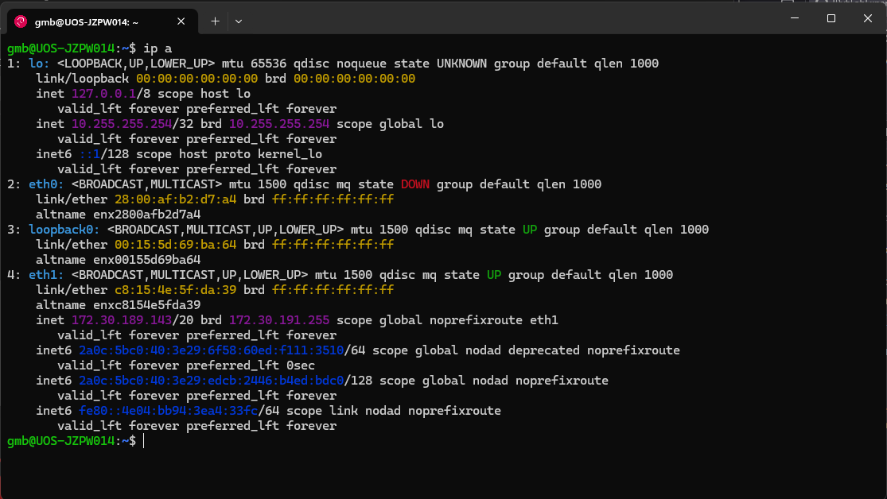
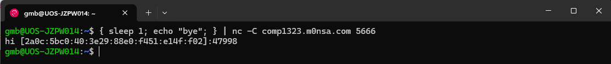
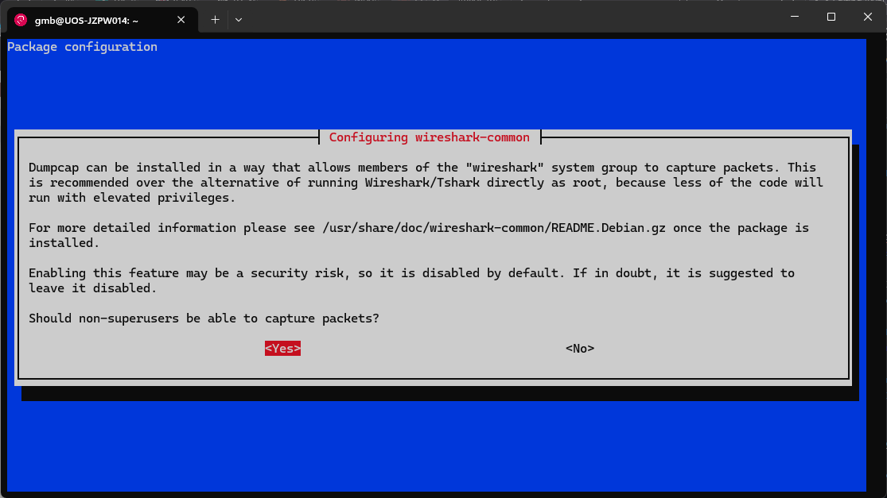

# Lab Experience Intro

This is an example of a basic networking lab that embraces the IPv6-first ethos of teaching computer networking to students. This is based on an assessed lab that all Part I CS students do. The students are given learning outcomes focused on their use of Wireshark, but this lab exposes them to IPv6, routing, network tools, telnet and basic networking skills:

This laboratory exercise aims to:
* Give you experience using the Wireshark packet sniffer
* Give you some basic Linux experience

Having successfully completed the lab, you will be able to:
* Use Wireshark to intercept and analyse network traffic
* Construct appropriate Wireshark Display Filters to limit the information presented by Wireshark.
* Construct appropriate Wireshark Capture Filters to limit the information captured by Wireshark.

For students taking the lab, assessment is done using two Moodle tests/quizzes that are automatically marked. The first is preparation that they complete before the lab, the second is progress and understanding that they complete in the final ~30 minutes of the lab.

Steps to follow are marked with a ❇️.  Things for students to explore and note in their logbook are marked with a ❓ (this is stuff that students might need to answer the end of lab quiz)

# 1. Setting Up 
This lab will give you an introduction to using Wireshark to investigate network packets and to see how different protocols behave. You will also gain some experience of using some simple Linux networking tools. All of the exercises in this lab will be done over IPv6.

## WSL Environment

If you are using Windows for this lab, we need to set up a WSL environment that makes use of [mirrored mode networking](https://learn.microsoft.com/en-us/windows/wsl/networking#mirrored-mode-networking). This needs Windows 11 22H2 or newer. To do this:

 ❇️ 	Download .wslconfig and copy it to `%USERPROFILE%`. If using file browser this is you home folder.

*NOTE:* When you download this file, make sure its name includes dot like ".wslconfig" and not "wslconfig"

This config file enables mirrored mode networking for all WSL2 guests and places the Linux environment directly on the same network as the host. `%USERPROFILE%` is an alias for the root of your user profile directory (usually C:\Users\<username>). Enter `%USERPROFILE%` in the Windows Explorer address bar to be taken there.

The file contains three lines:

```
[wsl2]
# Enable mirrored networking for all WSL2 instances
networkingMode=mirrored
```

Once you have the config file, open a Powershell terminal and install a Linux distribution for this lab. This lab was designed around a Debian-based distribution, but if you already have Linux experience and have a preferred distribution, you are welcome to use that.

❇️ 	Install a WSL Linux distribution by typing either `wsl --install debian --name "IPv6Lab"` or `wsl --install ubuntu --name "IPv6Lab"`. This installation may take a few minutes.

❇️ 	Once installed, your terminal will end up in the Linux environment and you will be prompted to "Enter a new UNIX username".
Enter a username (your University username would be a good choice) and then a password when prompted.

*Note:* If you have installed Debain (or certain other distributions), you will need to set permissions to allow ping to work. Do this by entering `sudo setcap cap_net_raw+p /bin/ping`

You now have Linux running on top of Windows with the same networking provision as the Windows host. We can check this by looking at the IP addresses shown on the post-installation welcome screen or by entering ip a. If the networking is configured correctly, then you should see IPv6 addresses that start with `2001:630:d0:...` like the screenshot below. 



If you don't see IPv6 addresses and have the config in-place as `%USERPROFILE%\.wslconfig` (yes, the "." is important), then you need to restart the WSL instance. Close the WSL window and open a Powershell window. Type `wsl --shutdown`, and then re-open WSL by clicking the arrow to the right of your Powershell tab and then clicking IPv6Lab (you could also try pressing `ctrl + shift + 4` or `ctrl + shift + 5` and seeing what that does).

❓ 	Note down the interface name that has the global address.

We now need to install some pre-requisites:
❇️ 	In the Linux environment, enter `sudo apt update` and enter your password when prompted. This will update the package cache.
❇️ 	Install the dependencies for this lab by typing `sudo apt install traceroute python3 python3-scapy curl wget dnsutils telnet netcat-openbsd nmap sl`.

We can check that everything is happy by typing `{ sleep 1; echo "bye"; } | nc -C comp1323.m0nsa.com 5666` into the Linux environment, which will give output similar to this:



# 2. Wireshark

We will be using Wireshark to inspect packets in this lab. Ideally you will have Wireshark installed natively. If you don't and you are using WSL, you can install it within WSL with `sudo apt install wireshark`. Note that you will want to allow non-superusers to be able to capture packets with Dumpcap (Select "yes" on the popup):



Before we can start capturing packets, we need to figure out which interface our traffic will be using.

 ❇️ 	Open Wireshark and watch the graphs shown next to each interface for a moment. It should be the only real interface with a moving line next to it. If it's not clear, open your browser and go to fast.com and see which line shows traffic.

 
