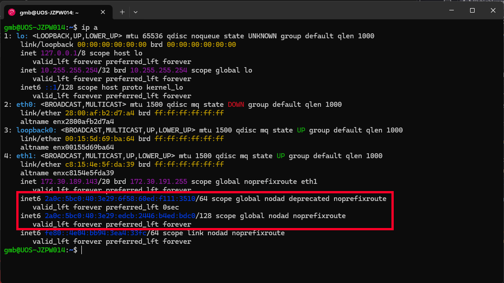
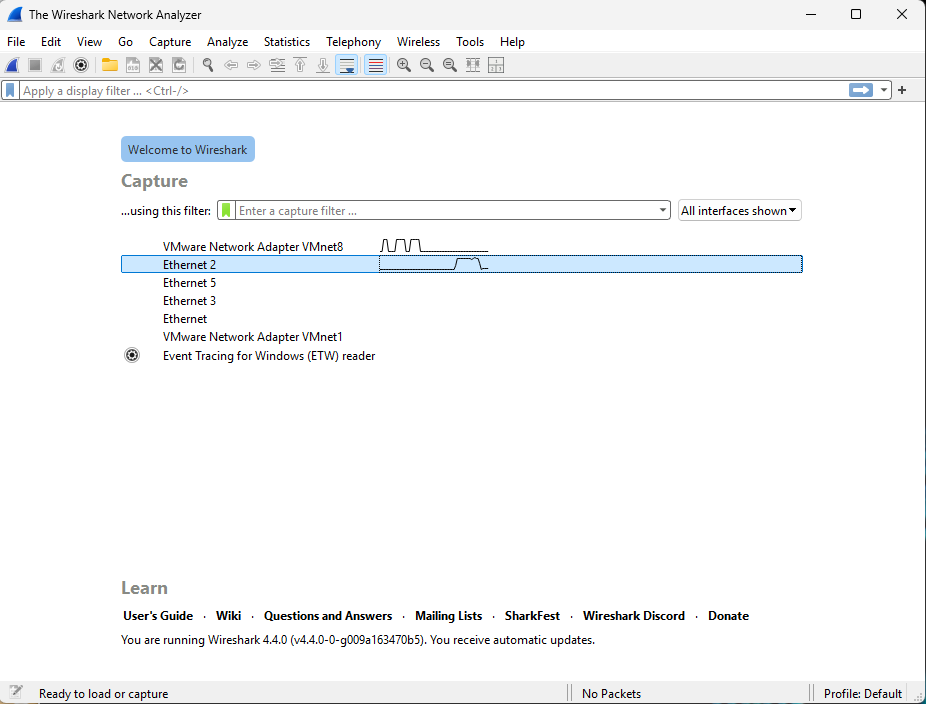

# IPv6 Lab Experience

This is an example of a basic networking lab that embraces the IPv6-first ethos of teaching computer networking to students. This is based on an amalgamation of two assessed lab that all Part I CS students do. 

The lab is designed to run under WSL2 on Windows 11 (at lease 22H2) with somewhat limited permissions on the host. You should be able to make most of this work under Linux or MacOS.

The students are given learning outcomes focused on their use of Wireshark and sockets, but the lab exposes them to IPv6, routing, network tools, telnet and basic networking skills:

This laboratory exercise aims to:
* Give you experience using the Wireshark packet sniffer
* Give you some basic Linux experience
* Familiarise you with simple client/server socket-based communications.

Having successfully completed the lab, you will be able to:
* Use Wireshark to intercept and analyse network traffic
* Construct appropriate Wireshark Display Filters to limit the information presented by Wireshark.
* Construct appropriate Wireshark Capture Filters to limit the information captured by Wireshark.
* Create and use sockets in simple Python applications.

For students taking the lab, assessment is done using two Moodle tests/quizzes that are automatically marked. The first is preparation that they complete before the lab, the second is progress and understanding that they complete in the final ~30 minutes of the lab.

Steps to follow are marked with a ❇️. Things for students to explore and note in their logbook are marked with a ❓ (this is stuff that students might need to answer the end of lab quiz)

# 1. Setting Up 
This lab will give you an introduction to using Wireshark to investigate network packets and to see how different protocols behave. You will also gain some experience of using some simple Linux networking tools. All of the exercises in this lab will be done over IPv6.

## WSL Environment

If you are using Windows for this lab, we need to set up a WSL environment that makes use of [mirrored mode networking](https://learn.microsoft.com/en-us/windows/wsl/networking#mirrored-mode-networking). This needs Windows 11 22H2 or newer. To do this:

 ❇️ 	Download [.wslconfig](http://comp1323.m0nsa.com/.wslconfig) and copy it to `%USERPROFILE%`. If using file browser this is you home folder.

**NOTE:** When you download this file, make sure its name includes dot like ".wslconfig" and not just "wslconfig"

This config file enables mirrored mode networking for all WSL2 guests and places the Linux environment directly on the same network as the host. `%USERPROFILE%` is an alias for the root of your user profile directory (usually C:\Users\<username>). Enter `%USERPROFILE%` in the Windows Explorer address bar to be taken there.

The file contains three lines:

```
[wsl2]
# Enable mirrored networking for all WSL2 instances
networkingMode=mirrored
```

Once you have the config file, open a Powershell terminal and install a Linux distribution for this lab. This lab was designed around a Debian-based distribution, but if you already have Linux experience and have a preferred distribution, you are welcome to use that.

❇️ 	Install a WSL Linux distribution by typing either `wsl --install debian --name "IPv6Lab"` or `wsl --install ubuntu --name "IPv6Lab"`. This installation may take a few minutes.

❇️ 	Once installed, your terminal will end up in the Linux environment and you will be prompted to "Enter a new UNIX username".
Enter a username (your University username would be a good choice) and then a password when prompted.

**Note:** If you have installed Debain (or certain other distributions), you will need to set permissions to allow ping to work. Do this by entering `sudo setcap cap_net_raw+p /bin/ping`

You now have Linux running on top of Windows with the same networking provision as the Windows host. We can check this by looking at the IP addresses shown on the post-installation welcome screen or by entering ip a. If the networking is configured correctly, then you should see IPv6 addresses that start with `2001:630:d0:...` like the screenshot below. 



If you don't see IPv6 addresses and have the config in-place as `%USERPROFILE%\.wslconfig` (yes, the "." is important), then you need to restart the WSL instance. Close the WSL window and open a Powershell window. Type `wsl --shutdown`, and then re-open WSL by clicking the arrow to the right of your Powershell tab and then clicking IPv6Lab (you could also try pressing `ctrl + shift + 4` or `ctrl + shift + 5` and seeing what that does).

❓ 	Note down the interface name that has the global address.

We now need to install some pre-requisites:

❇️ 	In the Linux environment, enter `sudo apt update` and enter your password when prompted. This will update the package cache.

❇️ 	Install the dependencies for this lab by typing `sudo apt install traceroute python3 python3-scapy python3-venv curl wget dnsutils telnet netcat-openbsd wireshark sl`.

Note that you will want to allow non-superusers to be able to capture packets with Dumpcap (Select "yes" on the popup):


We can check that everything is happy by typing `{ sleep 1; echo "bye"; } | nc -C comp1323.m0nsa.com 5666` into the Linux environment, which will give output similar to this:


## Wireshark

We will be using Wireshark to inspect packets in this lab. WE will need to run Wireshark under WSL for Sections 4 and 5, but you can run it natively for the other exercises. 

Before we can start capturing packets, we need to figure out which interface our traffic will be using.

 ❇️ 	Open Wireshark and watch the graphs shown next to each interface for a moment. It should be the only real interface with a moving line next to it. If it's not clear, open your browser and go to fast.com and see which line shows traffic.



Let's check that we have the correct interface.  

❇️ 	Start a capture on the interface that you think is the right one. You should see lots of packets scrolling through the window.

❇️ 	Enter `ipv6.addr == 2600::` in the box that says "Apply a display filter..." and press enter. You should have an empty window.

❇️ 	In your Linux terminal, run `ping -c5 2600::`. You should see some packets appear in Wireshark.
Investigate these packets by expanding the fields in the Packet Details pane in the lower left of Wireshark.

**Note:** there is a bug in WSL's IPv6 networking stack that means you may see ICMPv6 "Parameter Problem" messages when capturing ping replies destined for WSL. You can safely ignore these.


❓ 	Note down the ASCII representation of the last eight bytes of data that ping included in the ICMPv6 Echo request packets.

The Wireshark window has a few different elements that we will be making use of during the lab. The screenshot below highlights the important fields that we will be using:


You may want to arrange your display into a 3-way split so that you can see these notes, your Linux terminal and Wireshark. The Windows 11 Window Manager lets you [snap your windows into various arrangements](https://support.microsoft.com/en-gb/windows/snap-your-windows-885a9b1e-a983-a3b1-16cd-c531795e6241) - hover your mouse over the Minimise or Maximise button and the layout box will pop up. The layout with an equal 3-way split works well on the Level 3 Lab PCs.

You should now have a configured WSL guest and running Wireshark capture. 

## A NAT Sidequest (Optional, for extra understanding)

A little earlier you used `nc` to connect to a little demo Python server that listens on TCP port 5666 and sends back the IP address and source port it sees. If you want to have a look at the server, you can download the script here.

We can do the same thing over IPv4 while we sniff the traffic in Wireshark to see what NAT is doing to our connection.

❇️ 	Stop the capture and start it again with no capture filter.

❇️ 	Change your display filter to `tcp.port==5666`.

❇️ 	In your Linux terminal, run `{ sleep 1; echo "bye"; } | nc -C comp1323.m0nsa.com 5666`. You should some packets appear in Wireshark.

❇️ 	In your Linux terminal, run `{ sleep 1; echo "bye"; } | nc -4 -C poets-project.org 5666`. You should some more packets appear in Wireshark, but involving IPv4 addresses. This command will print an IPv6-mapped IPv4 address, you can ignore the "`::ffff:`" at the start.

If you explore the packets a little, you should see that the line printed when you sent packets to the server over IPv6 matches what you see in Wireshark whereas the packets sent over IPv4 involve different IP addresses and ports.

**Note:** This is the only bit of the lab that involves IPv4... And you will want to put the capture filter back in place before moving on.

# 2. Telnet

In this exercise you are going to explore what a simple telnet connection looks like at the packet level. Telnet is a client/server protocol for accessing a virtual terminal across a network - think of it as similar to SSH, but we can see what is going on inside packets in using Wireshark. 

We aren't going to use it to access a terminal though, we are going to watch part of a movie by telneting to `towel.blinkenlights.nl`.

We find that this gives students an appreciation for how what they see on the wire can relate to what they see visually.

❇️ 	Make sure that you have Wireshark open and running a capture on the network interface that corresponds to the labs network.

❇️ 	Enter a display filter that only shows traffic sent to and from `towel.blinkenlights.nl`. **Tip:** display filters work with IP addresses, think how you might find the IPv6 address for this domain with the tools you have already used in this lab.

❇️ 	In your WSL terminal, connect to the telnet server by typing telnet `towel.blinkenlights.nl`.
Watch what happens in your terminal and in Wireshark.

❇️ 	When you have watched a few frames, disconnect from Telnet by pressing `ctrl + ]` followed by `q <enter>`.


Investigate the packet capture and explore the packets involved in establishing the connection and ending the connection.
Also investigate the Telnet data packets and note how the contents relate to what you saw in the terminal. Don't spend more than 10-15 minutes on this.

❓ 	Note down the display filter that you used.

❓ 	Which transport layer protocol does Telnet use?

❓ 	What was the film?

❓ 	How many packets were involved in creating the Telnet connection (before the first displayed frame was sent)?

❓ 	How many packets were involved in closing the connection?

# 3. Traceroute

Many students will have come across `traceroute` at some point. This exercise lets them see how the utility works at the packet level and explore how the Hop Limit/TTL works. These instructions are written for a Linux environment, you can adapt them for Windows or Mac without too much difficulty.

You will be investigating the routing to five different hosts:

    2a0c:5bc0:40:3e29::3
    2a0c:5bc0:0:75::91
    www.imperial.ac.uk
    sown.org.uk
    comp1323.m0nsa.com

❇️ 	Make sure that you have Wireshark open and running a capture on the correct interface.

❇️ 	Enter a display filter that only shows traffic sent to and from the five hosts.

❇️ 	Verify that the display filter works by pinging each of the five hosts from your Linux terminal. This should be the only traffic that you see. **Tip:** You can apply multiple filters by using an OR operation. e.g. `ip.addr == 10.22.36.21 || ip.addr == 152.78.103.253 || ip.addr == 146.179.42.148` would show traffic for three IPv4 hosts.

❓ 	Note down the display filter that you used.

Traceroute works by sending probes with an increasing hop limit and looking for Time Exceeded responses from intermediate routers. It stops sending responses after it receives a response from the destination, but may send more requests than it needs. We will be using the IPv6 version of Traceroute (traceroute6) for this exercise. You may want to investigate the options that traceroute has by typing `traceroute6 --help` in your Linux terminal.

❇️ 	Restart the current capture in Wireshark by clicking the "Restart current capture" button:
Click "Continue without Saving" on the dialogue that pops up as we don't need the original capture.

❇️ 	Run a traceroute to `2a0c:5bc0:0:75::91` from your Linux terminal by typing `traceroute6 -q1 2a0c:5bc0:0:75::91`.


From this capture, you should be able to see how Traceroute behaves on Linux. Investigate the packets that you've captured in Wireshark, paying attention to how the Hop Limit in the IPv6 headers changes, the data sent by traceroute and to the contents of the ICMPv6 Time Exceeded messages.

❓ 	Which protocol does Traceroute on Linux use by default?

❓ 	What does traceroute include in the data field at the end of the packet?

❓ 	What hostname does `2a0c:5bc0:0:75::91` have?

❓ 	What does the "-q1" argument that we used mean?


For completeness, we are going to have a quick look at how Windows handles traceroute:

❇️ 	Open another Powershell tab or window (you can click "+" on the title bar of the window that has your Linux terminal).

❇️ 	Run a traceroute to `2a0c:5bc0:0:75::91` from this terminal by typing `tracert 2a0c:5bc0:0:75::91`.


Have a look at the packets you just captured. You should see that the Windows and Linux/Unix versions of Traceroute use different protocols by default. The Windows version has far fewer arguments and can be less flexible than the Linux/Unix version, but the default behaviour is likely to work for more destinations.

❓ 	Which protocol does Traceroute on Windows use by default?

❓ 	What does `tracert` include in the data field at the end of the packet?


We are now going to move back to Linux and explore the rest of the destinations. 

❇️ 	In your Linux terminal, run _traceroutes_ to the other three destinations. **Tip:** Don't forget to use traceroute6 rather than traceroute.

❓ 	How many hops did it take to reach each destination?

Look at the packet capture alongside the terminal output and try to figure out what is going on with any hops that have a "*" rather than a time. Also pay attention to the output in the terminal and think about what each of the _traceroutes_ is telling you about the structure of the network and where each host is. 

You should have noticed that the _traceroute_ to `www.imperial.ac.uk` never received a response from the intended destination. Interestingly, it would have finished with the Windows version of _traceroute_. We can make the Linux/Unix version behave more like the Windows version by telling _traceroute_ to use the same protocol.

❇️ 	In your Linux terminal, run a _traceroute_ to `www.imperial.ac.uk` using the same protocol as a Windows _traceroute_. **Tip:** `traceroute6 --help` will show you all of the possible arguments for _traceroute_. You will need to use sudo to run _traceroute_ as root for this part of the exercise.

This _traceroute_ should have completed and you should be able to see the difference in how the two different protocols behave. Explore the structure of the packets sent by _traceroute_ and note how the data sent differs from ping.

❓ 	Which argument did you have to use to make _traceroute_ complete with `www.imperial.ac.uk`?

❓ 	What does _traceroute_ include in the data field at the end of the packet when you use this protocol?

❓ 	Think about why `www.imperial.ac.uk` exhibits the behaviour it does with the default protocol used by _traceroute_.

You should now have more of an idea of how Traceroute works and how Wireshark can help us to investigate the behaviour of network protocols.

# 4. TCP

In the introductory lab that all of these exercises have come from so far, students would now go on to explore Router Advertisements, Neighbour Discovery and NMAP. Multicast on WiFI is always a little finickity and I'm not sure Imperial would like us all doing port scans so we are going to explore TCP and UDP instead. Sections 4 and 5 are sourced from a second lab that leads students to writing an IPv6 UDP chat app (yes, it works with multicast and yes we have had multicast ASCII Rick Rolling...)

In this exercise you are going to investigate a simple TCP client/server, similar to what you have seen in the preparation.

## Lab Code & Virtual Environment

You need to download the code for this lab in WSL and untar it.

❇️ 	Make sure you are in WSL's home directory (`~` and not `/mnt/c/Users/<username>`). you can get there by entering `cd.`

❇️ 	In the Linux environment, enter `wget comp1323.m0nsa.com/n2.tar.gz`

❇️ 	Untar the file by entering `tar -zxvf n2.tar.gz` to unpack the contents of the tarball into the current directory.

**Note:** These files do NOT have Shebangs, so you cannot execute them with `./<filename>`. You will need to do `python3 <filename>` for any files you wish to execute.

We will need a Python venv for installing packages later on, so let's create this now.

❇️ 	Enter `python3 -m venv n2venv`.

❇️ 	Activate the environment by typing `source ./n2venv/bin/activate`

**Note:** You will need to have this venv active in any new terminals that you open, so run the above source line any time you open a new one.

If you wish to use an IDE rather than `nano` at the command line, you can use Visual Studio Code on the Windows host to interact with the WSL environment. Instructions at the end of these notes and a helpful guide [here](https://code.visualstudio.com/docs/remote/wsl).

## TCP Exercise

❇️ 	Open a WSL terminal and start `wireshark`.

❇️ Start a Wireshark capture on the "any" interface and apply a display filter that only shows IPv6 traffic involving `::1`. The "any" interface is not a feature on Wireshark on Windows and the host doesn't always see link-local traffic inside WSL, which is why we need to run Wireshark in WSL for this task.

❇️ 	In a new WSL terminal, activate the venv and execute `simpleserver.py`.

`simpleserver.py` is an example of a simple server that listens on a specified port and sends back a short message when a client connects. Have a look at the code in your editor of choice.

❓ 	What port does the server listen on?

You now need to connect to this server with a simple client.

❇️ Open a second WSL terminal, activate the environment and execute `simpleclient.py` twice and note the output from the server.

❓ 	What do you notice about the client source ports reported by the server? Is the source port the same each time?

❓ 	Note how many packets your client-server interaction caused in Wireshark.

This is a good reminder of the TCP setup and tear-down. Which number packet contains the "thank you..." message from the server? (look at packet containing the Data (24 bytes) )

# 5. UDP

Students get to see a lot of TCP, but understanding UDP is an important skill as well, especially with the growing prevelance of QUIC. In this exercise you are going to explore UDP client and server communications.

❇️ 	Stop the `simpleserver.py`.

❇️ 	Execute `simpleserverUDP.py`.

`simpleserverUDP.py` is an example of a simple UDP server that listens on a specified port. Unlike the TCP example, the server does not reply to the client.

Have a look at the code in your editor of choice.

❓ 	What port does the server listen on?

You now need to send data to this server with a simple client.

❇️ 	Execute `simpleclientUDP.py` twice and look at the packets in Wireshark. 

❓ 	What do you notice about the client source ports reported by the server? Is the source port the same each time?

❓ 	How many packets does one client-send trigger?

❓ 	You sent a 13 byte message but how many bytes is the whole Frame?


UDP supports two-way communication as well. Think about how you can change the client and server to have similar behaviour to the TCP implementation.

❇️ 	Modify simpleclientUDP.py and simpleserverUDP.py so that:
* the server sends a response of "Hello, client" to each client.
* the client prints the server response. 

**Hint:** The Client holds the answer to a Server sending a message, and the Server holds the answer for the Client receiving a message.
